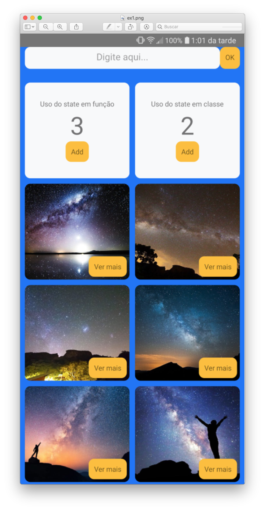

### App React Native com 3 funcionalidades distintas
#
### POST/Restful
- Envia String digitada no Input para o servidor NodeJS
#
### Contador (state)
- Componente de classe
- Componente funcional
#
### GET/Restful
- Imagens / Fetch API
#

  
  

